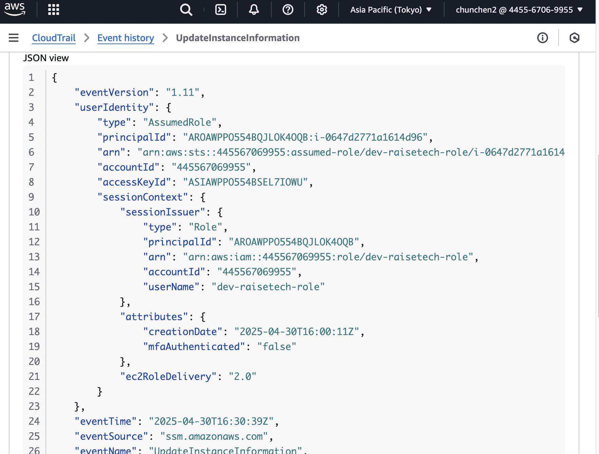

# 課題６
## 1.  CloudTrailからイベント内容の報告
**イベント名：** "UpdateInstanceInformation"\
**"awsRegion":** "ap-northeast-1"\
**"userIdentity":** ユーザーを特定できる諸情報 *(画像参考)*\
**"eventTime":** "2025-04-30T16:30:39Z"

## 2.  CloudWatch Alarmの設定
1. "UnhealthyStateRouting"というmetricをAlarmに追加

1. Amazon SNSを設定（Topicを作成した）

1. サイトは通常通りに動作していることを確認

1. Nginxを停止

1. サイトが動かなくなっている

1. ５分後にAlarmが発火され（無料で利用できる検知頻度は最短５分間隔のため）

1. 通知メールが届いている

1. Nginxを再起動させたらAlarmがOKに戻った

## 3. AWS 利用料の見積作成
今まで作成していた環境のスペックを基づいて作成してみました。\
Amazonの一年間無料サービスがなければ一年間はこのぐらいかかるのは少しびっくりしました。\
RDSの利用について、利用者数が平均１日三人程度で見積もっています。（ChatGPTに相談）。\
使っていたサービスを全部入れるつもりです。ただ、あっているかどうか少し不安です\
~[見積もりv1リンク](https://calculator.aws/#/estimate?id=533fdd5ab5b09d1949dedf923302b3bcf3de120d)~

### 修正メモ-v2：
**選択しているサービス:**
* EC2：こちらは無料利用枠と同じのt2.microを選択しました。選択肢の中には中ぐらいのスペックで、一般なサイトでは十分だと思います。アプリの設置場所として使っています。
* S3：ユーザーがアップロードしている画像を保管する場所として使っています。S3を使うことでコストはRDSよりはるかに軽減できました。
* VPC：EC2を使って環境構築には必要なバーチャルネットワークのサービスです。
* ALB：サイトにくるリクエストをバランスよくインスタンスに分配してくれるサービスです。インスタンスは1個しか使っていないので、あまり意味がないと思いますが、本当はあった方がいいと思い、保留しました。

**選択していたが、削除したサービス:**

* RDS：データーベースとして、サイトのユーザーの関連情報を保管する場所として使うことだそうです。課題４で作ってEC２のインスタンスに繋がせるようにしていましたが、サンプルアプリだと使わなくてもいいかと思い、削除しました。
* EBS：インスタンスにあるStorageで、アプリの資料を保管する場所として使うつもりです。インスタンスには初期的に8gbのEBSが付いていることを気づかなくて、追加していました。インスタンスに付いている分は十分で、追加分を削除しました。

~[見積もりv2-リンク](https://calculator.aws/#/estimate?id=7095f13924a9e0662ed228edb61c0dcf9a0334cc)~

### 修正メモ-v3：
ec2のpayment optionを利用する分のみ請求されるプランに変更しました。（Saving plan→On-demand）\
~[見積もりv3-リンク](https://calculator.aws/#/estimate?id=78e9f201c86f6a6e79065bf82e1c519ba0e167c5)~

### 修正メモ-v4：
データーの保存先のRDSを復元しました。\
~[見積もりv4-リンク](https://calculator.aws/#/estimate?id=2c06d7971306991c67bd4b290b6b178039f62452)~

### 修正メモ-v5：
不要のS3-select(*SQLでS3から特定のデーターを抽出する機能*）をS3から削除しました。
>S3-select:a feature that lets you run SQL-like queries directly on data stored in S3., such as in:
>   - CSV files
>   - JSON files
>   - Apache Parquet files
> 
>You can query only the specific rows/columns you need, which saves bandwidth and speeds things up.

[見積もりv5-リンク](https://calculator.aws/#/estimate?id=bb2b0f90a41ba488089c357a4bc3833d394df5ad)

## 4.　先月の利用料金状況
0.06ドルほど請求されています。\
利用明細によるとVPCのIP4 public addressの料金だそうです。\
おそらくALBの利用料金だと思っています。
コストを抑えるためになるべく使わないときにALBを削除したり、EC2をストップさせたりするように意識していました。

