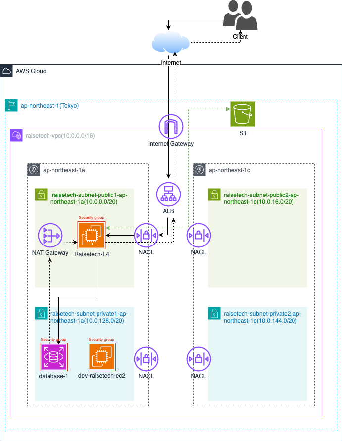

# 課題５
## 組み込みサーバーでサンプルアプリを起動：
最初は無事に起動して、サイトにアクセスできましたが、下記のエラーが起きていました
>「Showing /home/ec2-user/raisetech-live8-sample-app/app/views/layouts/application.html.slim where line #8 raised:
The asset "application.css" is not present in the asset pipeline.」

調べたら、サイトに使うAssets（画像、CSS、Javascriptなど）は`precompile`という処理しないとサーバーが必要のAssetを読み込めないようです。
precompileは使うAssetsを集めて、特定なフォルダーに保存してくれるとのことだそうです。

## アプリサーバーを分けて動作確認：
### 1. 組み込むサーバーとunix socketを使ったRailsアプリの動作確認：

  　**unix socketに変更：**
  - Pumaをunix socketにlistenするように設定：

  - ちゃんとunix socketが作られていることを確認：

### 2. Nginxと組み込みサーバー、Unix Socketを組み合わせてのRailsアプリ動作確認：
`"sudo nano /etc/nginx/conf.d/rails_app.conf"`でNginxを設定しました。

Nginxを起動してみる途中に、下記のエラーが出てきました：
> "502 Bad Gateway　nginx/1.26.3"

NginxがPumaと会話できないとのことだそうで、調べたらunix socketの設定が調整必要だとわかりました。\
最終にたどり着いた原因はunixのpathは絶対pathでないといけないようで、`puma.rb`と`ngnix.conf`のpathを下記のように修正しました。
> "unix:///home/ec2-user/raisetech-live8-sample-app/tmp/sockets/puma.sock"

また、Nginxのエラーログを確認したら、一部のファイルは権限不足だと言われていました。
> "/home/ec2-user/raisetech-live8-sample-app/public/favicon.ico" failed (13: Permission denied),..."

最初はファイル単体の権限を解放するように試していましたが、解決できませんでした。
>「sudo chown -R ec2-user:ec2-user /home/ec2-user/raisetech-live8-sample-app/public/favicon.ico \
sudo chmod 644 /home/ec2-user/raisetech-live8-sample-app/public/favicon.ico \
sudo chown -R ec2-user:ec2-user /home/ec2-user/raisetech-live8-sample-app/tmp/sockets \
sudo chmod 777 /home/ec2-user/raisetech-live8-sample-app/tmp/sockets/puma.sock」

調査した結果、parent folderの権限も与えないといけなかったようです。\
`"sudo chmod +x /home/ec2-user"`で権限を与えて解決できました。

## ALBを追加：

ALBのdomain nameでアクセスできるように調整が必要でした。\
最初はRailsが指定されていないhost nameをブロックするので、ALBのdomain nameでアクセスできませんでした。\
そのため、`config/environments/production.rb`に以下のテキストを追加しました。
> config.hosts << "alb-for-hw5-1342417124.ap-northeast-1.elb.amazonaws.com"

ただ、appの環境は**production**ではなく、**development**を使っていたため、解決できませんでした。\
原因気づいたら、deployment.rbにhost nameを追加したら解決しました。

## S3を追加（画像の保存先として利用）：
1. **SDK gem**を使って、S3をインストールしました。
2. AWSのコンソールでS3のバケットを追加しました。
3. EC2にIAM roleを追加しました。（AmazonS3FullAccess policyを追加した)

4. `config/storage.yml`を以下のように編集しました。

5. `config/environments/development.rb`にactive storageを**amazon**に指定しました:

6. 写真はアップロードできましたが、画像がちゃんと表示されていなく、画像を開くようとしたら、エラーが出てきました。
>「ActiveStorage::Representations::RedirectController#show
Could not open library 'vips.so.42': vips.so.42: cannot open shared object file: No such file or directory.
Could not open library 'libvips.so.42': libvips.so.42: cannot open shared object file: No such file or directory.」

画像を処理するlibraryが欠けていましたようです。

講師と相談したら、**Amazon linux 2023**の環境ではインストール方法の情報が少ないことがわかりました。\
ただ、アドバイスいただいたキーワードで検索してみたら、下記のサイトに直接インストールする方法もありまして、解決できました。
*https://github.com/amazonlinux/amazon-linux-2023/issues/295*

### S3の動作確認：
1. サイト上でfruitsを追加しました。

2. S3上に追加したことを確認しました。

3. 追加したものを削除してみました。

4. 削除したことを確認しました。

## 構成図：

## 感想：
今回の課題は広くて、何度も壁にぶつかりました。壁にぶつかる際に自分の知識不足であることがすこく感じています。特にネットワークの構成という基礎のことでも苦戦していて、AWSコース以外に学習しないといけないことがまだたくさんあることがわかりました。
また、壁にぶつかるたびに立ち直すスピードをもっと早くできればと反省しております。
