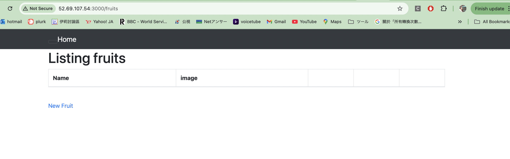
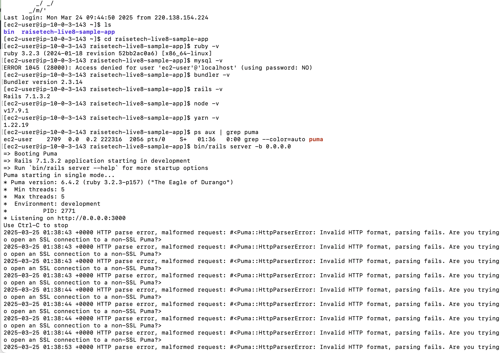
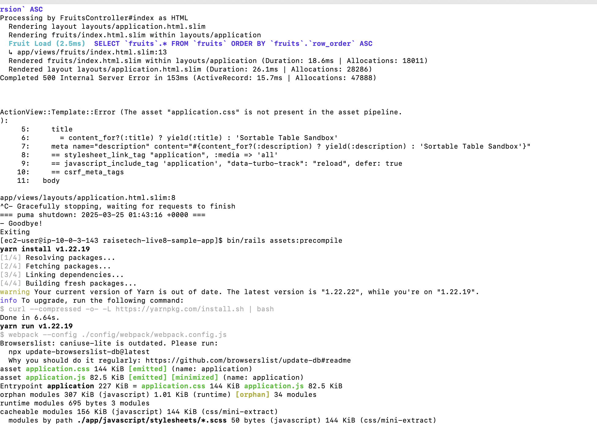
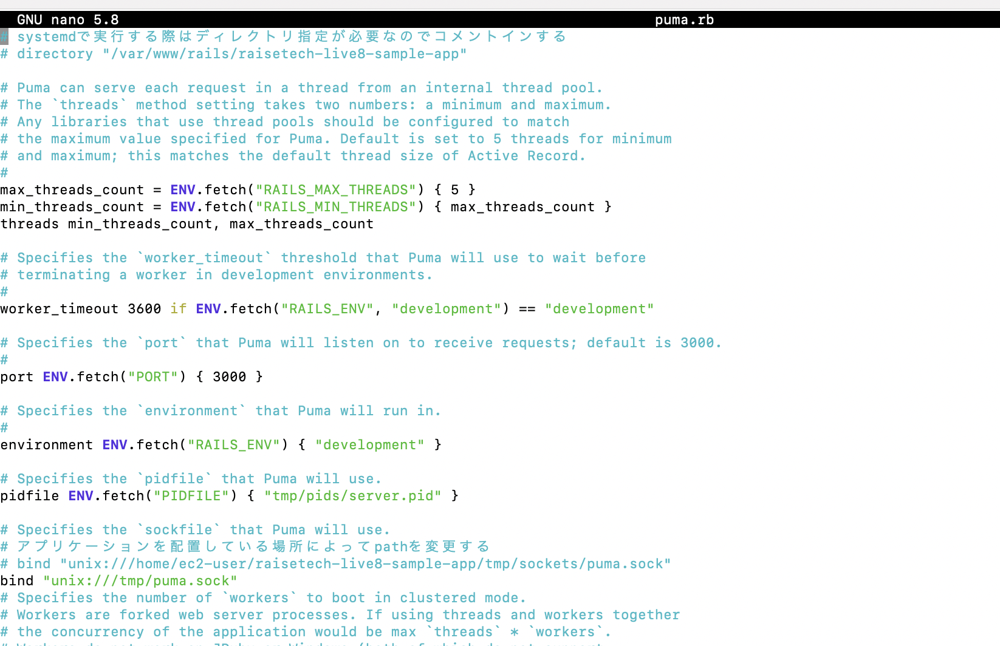
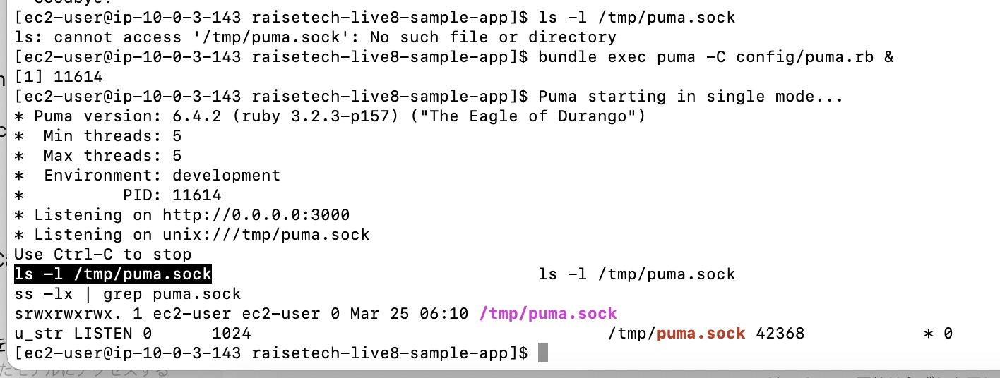
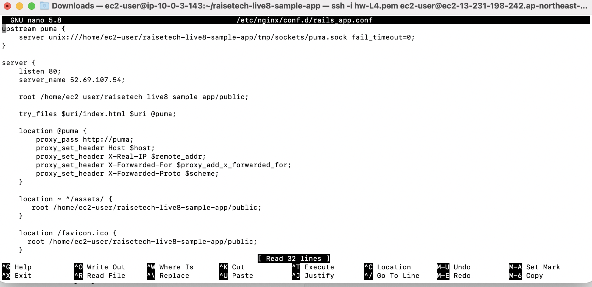

# 課題５
## 組み込みサーバーでサンプルアプリを起動しました。
最初は無事に起動して、サイトにアクセスできましたが、下記のエラーが起きていました
「Showing /home/ec2-user/raisetech-live8-sample-app/app/views/layouts/application.html.slim where line #8 raised:
The asset "application.css" is not present in the asset pipeline.」
調べたら、サイトに使うAssets（画像、CSS、Javascriptなど）はprecompileという処理しないとサーバーが必要のAssetを読み込めないようです。
precompileは使うAssetsを集めて、特定なフォルダーに保存してくれるとのことだそうです。

## アプリサーバーを分けて動作確認
1. 組み込むサーバーとunix socketを使ったRailsアプリの動作確認
**unix socketに変更**
Pumaをunix socketにlistenするように設定

ちゃんとunix socketが作られていることを確認しました。

3. Nginxの単体起動確認
"sudo nano /etc/nginx/conf.d/rails_app.conf"でNginxを設定する

Nginxを起動してみる途中に、"502 Bad Gateway　nginx/1.26.3"のエラーメッセージが出てきました。
NginxがPumaと会話できませんでした。unix socketの設定が調整必要だとわかりました。
結果、unixのpathは絶対pathでないといけないことがわかりました。
puma.rbとngnix.confのpathを"unix:///home/ec2-user/raisetech-live8-sample-app/tmp/sockets/puma.sock"に修正しました。

5. Nginxと組み込みサーバー、Unix Socketを組み合わせてのRailsアプリ動作確認

## ALBを追加しました
## S3を追加しました。（画像の保存先として利用）
## 構成図
