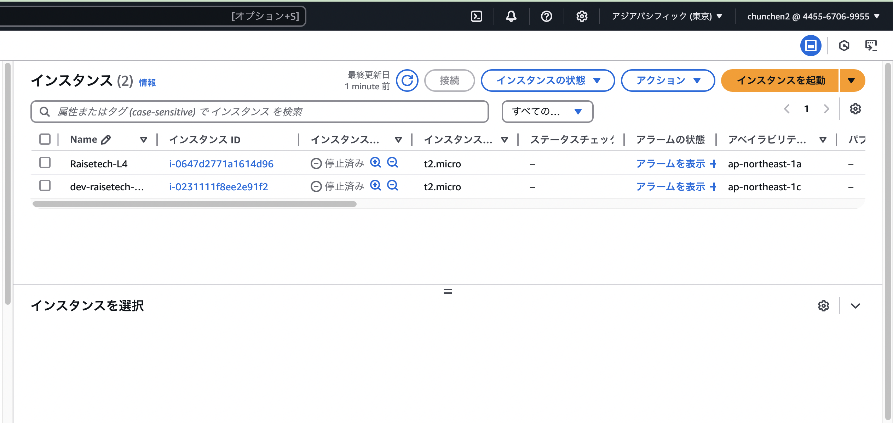
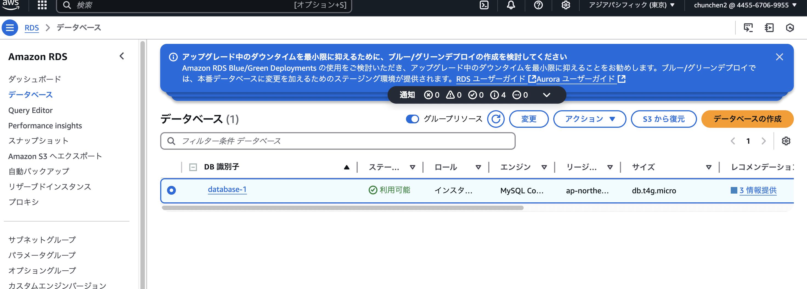
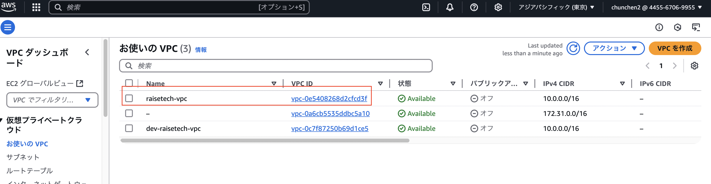
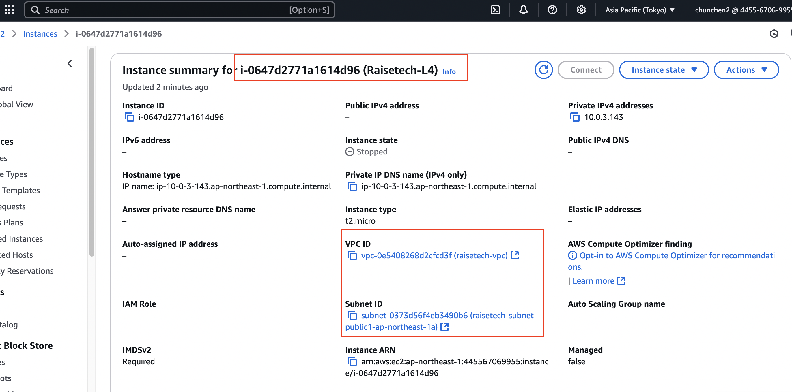
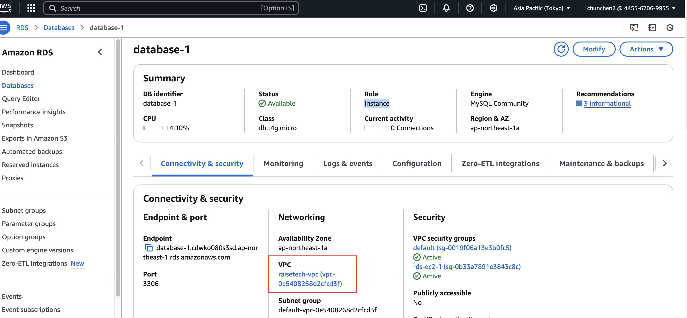
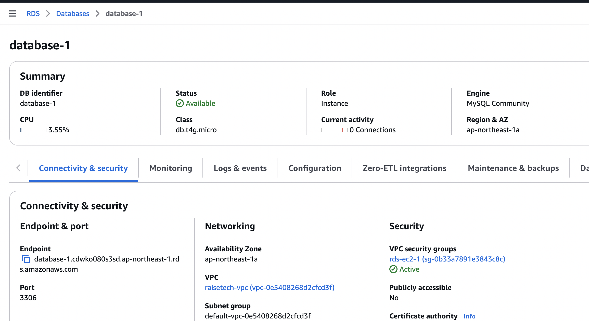
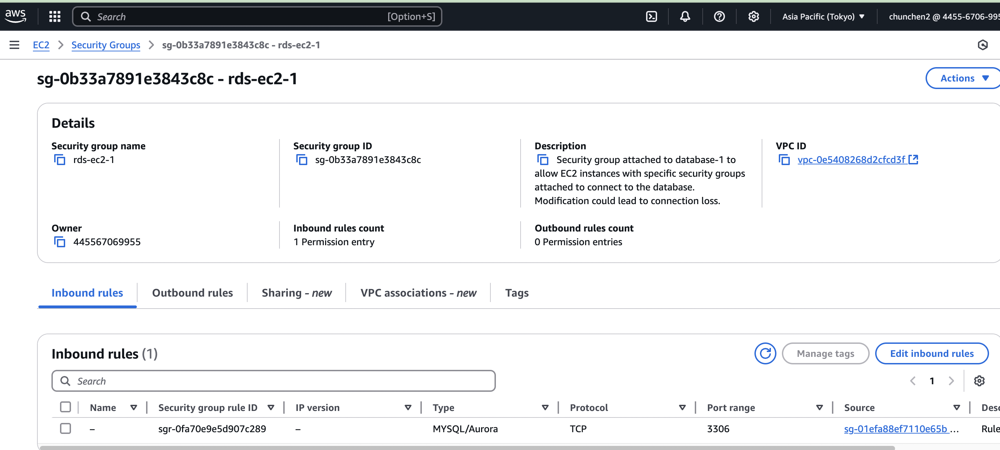

# Lecture-4

講義の手順通りにVPとEC2、RDSを作成して、連携させました。
SSH clientでリンクしました。

## 補足：
作成したリソースのエビデンスを追加いたしました。
* **EC2インスタンスーRaisetech-L4:**

* **RDS:**

* **VPC:**

## 補足20250309
* **作成したVPCのサブネットにEC2が作成されていること:**

* **作成したVPCのサブネットにRDSが作成されていること:**

## 20250318修正
* **EC2にアタッチしているsecurity group(rule)の設定:**  
1. 重複しているSGを削除しました。
1. inbound rulesを追加しました:SSHで自宅のipアドレスからしかアクセスできないように設定しました。

* **RDSにアタッチしているsecurity group(rule)の設定:**  
1. 重複しているSGを削除しました。

